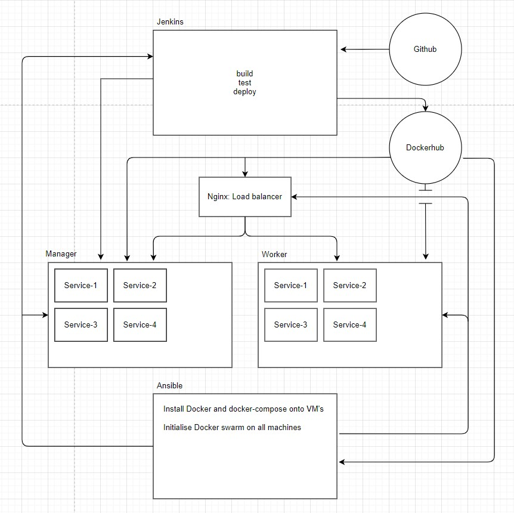

# Projesct-2-charecter-creation

# fundamental-project-1

## Contents
* [Introduction](#introduction) 
* [Proposal](#proposal)
* [Trello](#trello)
* [Risk Assessment](#risk-assessment)
* [Entity Diagrams](#entity-diagrams)
* [Development](#development)
* [Virtual Machines, GCP, File format](#Virtual-Machines,-GCP,-File-format)
* [Gitignore](#Gitignore)
* [Creating and populating tables](#Creating-and-populating-tables)
* [Creating Dockerfiles and Docker-compose.yaml](#Creating-Dockerfiles-and-Docker-compose.yaml)
* [Routes](#routes)
* [Frontend](#Frontend)
* [Docker Swarm and Docker Stack](#Docker-Swarm-and-Docker-Stack)
* [Testing](#testing) 
* [CI Pipeline](#CI-Pipeline)
* [Jenkins](#jenkins)
* [Known bugs and planned updates](#bugs)

# Introduction
The project included the creation of an application, split into four services - a Server to deliver html and compile information, 2 services to serve information through a simple api using GET requests, and a final service to recieve information from services 2 + 3 to create a new result. 

# Proposal
To create the MVP within the specified time period, the idea specified to meet criteria is a Character Generator, with Routes to generate a characters Race, Class, Blessing, Stats and Points. These will be split into services 2, 3 and 4. Service 1 will compile information from service 2, 3 and 4, present it on HTML, uplaod character to db insance on Mysql, and Query the 10 most recent generated characters.

# Trello
I began the project by listing out all tasks that i believed would need to be completed to meet the MVP - information for this was taken from QA Community to reduce the likelihood of missing an key element and was updated as the project progressed.

My trello board was updated as the project developed, however it is still only a simple trello board (utilises a few user stories and MoSCoW prioritisation stratagies). Trello functioned as to-do, doing, and done to clearly demonstrate the projects progress and was comprised of prodominatly crucial stages of operations.

# Risk Assessment
I created a Risk Assesment before beginning my project to highlight potential risks that i have identified.

I continued adding columns as the project progressed and i found a potential issue, including potential risks related to github secrets, docker secrets, as-live testing and any issues with the project that could cause delays.
Furthermore risk was updated and whether or not an issue occured to-date.

# Entity Diagrams
My entity diagram - shows how my services will link and operate. Details how the DB is attached to the servise:

My table ED - dictates original idea and final table format:

Project scope - all elements required for project completion and successfulll deployment of services:

- Unfortunatly i was unable to complete the entirety of the project on time - leaving some elements unfinished or missing. I therfore ammended my goals for the project with new expecations:

My actual project scope ended up as:

This is missing some key elements hat will need to be included in later versions of the service.

# Development
The project began with building all four services, my table in python and linking My application with my db made in mysql. I created a three VM's and a MySQL Instance using Google Cloud Provider, Created my db in MySQL, added firewall exceptions, and added permissions for VM to access database.  

## Virtual Machines, GCP, File format
Secondly was downloading and installing necessary software to create and run my app effectively, then creating a simple file structure for the project to function and maintain an acceptable level of organisation. 

## Gitignore
Added gitignore and added confidential files such as venv, credentials and pycache to prevent spilling secrets to github.

## Creating and populating tables 
Following the successfull creation and implementation of my VM's and its software i created my tables in python and linked my app to my db in MySQL.
After creating my tables i edited my create.py to populate the table with some example information to be used with testing.

## Creating Dockerfiles and Docker-compose.yaml
Dockerfiles where made in each service (in directory with app.py) to form images and build services using docker-compose. a docker-compose.yaml was created in my PWD and written to deply all necessary services one for each api built (server, class_appi, race_api and stats_api). initioal app deplyment was run using docker-compose up -d --build to create images and deploy containers. Images where also linked to my dockerhub at this stage and pushed.

## Frontend
A basic html homepage was costructed to allow access to the service. - will be updated in later versions of application (likely v1.3 to following 1.2 - current)

## Docker Swarm and Docker Stack
I began by using 2 of the 3 vms (leaving one alone for jenkins) to create a swarm making one manager and one worker node. I then used docker stack to create a stack with two replicas per container and deploy them across my 2 VM's 

## Testing
Created a test.py per service to test functionality of routes.
Tests cover: 
 - Testing Read for all available pages
 - testing random.choice
 - testing home
 - testing get and post routes.

Requires further testing before deployment including
 - Selenium used for integration testing
 - Port testing
 - Building database and tables
 - Populating tables
 - further coverage tests

Due to issues with pytest (likely due to simplified file structure ) pytest coverage was unable to run throughout the project and requires mending and implementing before final deployment - However all tests made passed pytest successfully.

## CI Pipeline 
Expected and Proposed CI Pipeline:

However due to time constraints and various issues i was unable to complete all tasks leaving my current pipeline as shown below:

## Jenkins
Jenkins is being utilised to setup and deploy working versions of my app and is working in its current state. 

Script was added, with permissions changed to execute and run. After logging in successfully i created my build. Furthermore i had to edit my sudo visudo to add jenkins permissions before it would run successfully

My db instance is used in execute bash shell currently, however my build is behind a secure jenkins login so the risk of a leak is low. (execute line is ommited)

Jenkins requires further implementation of webhooks and architecture to save build versions as zip files.

# Bugs 
 - Information entered into decimal feilds is currently tempermental and needs refining
 - Inclusion of drop down Choices for selecting receipts
 - Stats table created and working 
 - Date not entering correctly (shows None)

(to be added as they are discovered)
